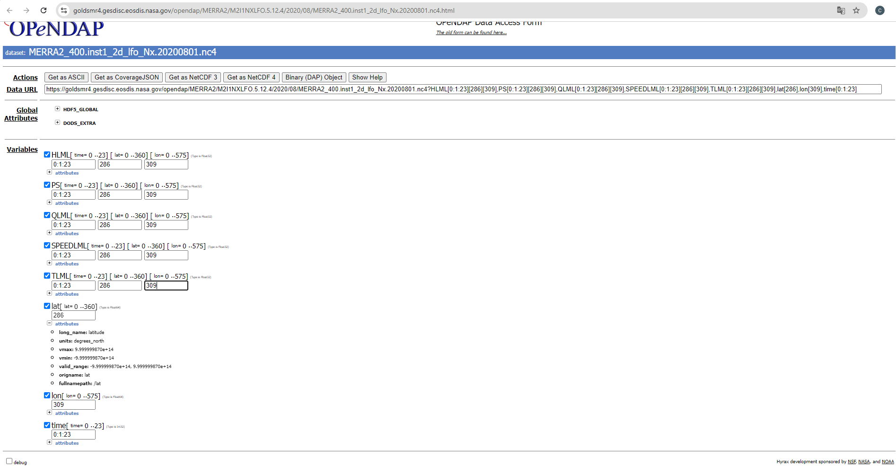

# Table of Contents
1. [Overview](#1-overview)
2. [Datasets](#2-datasets)
    1. [Dataset Overview Table](#21-dataset-overview-table)
    2. [Detailed Dataset Descriptions](#22-detailed-dataset-descriptions)
3. [Data Availability and Access](#3-data-availability-and-access)
    1. [Dataset Access and Limitations](#31-dataset-access-and-limitations)
    2. [Download Instructions](#32-download-instructions)
4. [Loading the Datasets](#4-loading-the-datasets)
5. [Analysis](#5-analysis)
6. [To_Dos](#6-to-dos)
7. [Exposé](#7-Exposé)


## 1. Overview <a name="1-overview"></a>
This is the overview section.

## 2. Datasets <a name="2-datasets"></a>
The datasets used in this study are described in this section.

### 2.1 Dataset Overview Table <a name="21-dataset-overview-table"></a>

#### Categorized by type

Day-ahead Electricity Market (1)
For the electricity market, all kinds of sources (wind, solar, gas) are aggregated.

| Type of Dataset                 | Dataset                       | Time Resolution | Time Period                   |
|---------------------------------|-------------------------------|-----------------|-------------------------------|
| **Aggregated**                  | Power 50Hertz/entsoe          | 15m             | 2016 ▮▮▮▮▮▮▮▮▮ 2024          |
|                                 | Historical Weather (2) Merra2 | 1h              | 2016 ▮▮▮▮▮▮▮▮▮ 2024          |
|                                 | Forecasted wind (3) open-meteo | 15m            | (2021▯▮▮)▮▮▮▮▮▮2024          |
| **Turbine**                     | Power zenodo                  | 10m             | (2016▯▯▮)-(2021▮▯)             |
|                                 | Historical Weather zenodo     | 10m             | (2016 ▯▯▮)-(2021▮▯)            |
|                                 | Forecasted wind (4)           | 15m             | (2021▮▯)                      |

---
**Notes:**
- (2): Data at the geographic center of the 50Hertz wind parks.
- (3): To be updated.
- (4): More data to be researched.
-----------------------------------------------------------------------

#### List

| **Data Category**               | **Description**                                                                                                             | **Time Period**          | **Time Resolution**               | **Additional Information**                                                                                                         |
|---------------------------------|-----------------------------------------------------------------------------------------------------------------------------|---------------------------|-----------------------------------|-------------------------------------------------------------------------------------------------------------------------------------|
| **1. Aggregated Power Generation** | [50Hertz's seven onshore wind parks](https://transparency.entsoe.eu/generation/r2/actualGenerationPerProductionType/show?name=&defaultValue=false&viewType=TABLE&areaType=CTA&atch=false&datepicker-day-offset-select-dv-date-from_input=D&dateTime.dateTime=01.01.2024+00:00\|CET\|DAYTIMERANGE&dateTime.endDateTime=01.01.2024+00:00\|CET\|DAYTIMERANGE&area.values=CTY\|10Y1001A1001A83F!CTA\|10YDE-VE-------2&productionType.values=B18&productionType.values=B19&dateTime.timezone=CET_CEST&dateTime.timezone_input=CET+(UTC+1)+/+CEST+(UTC+2)#) | 2016 - 2024              | 15-minute intervals               | Suggested Enrichment: Add weather data, installation capacity ([2019 - 2023](https://www.50hertz.com/xspProxy/api/staticfiles/50hertz-client/images/medien/almanach_2023/240527_50hertz_br_almanac_2023_1920x1080_en.pdf), [2018](https://www.50hertz.com/xspProxy/api/staticfiles/50hertz-client/images/medien/almanach_2023/240527_50hertz_br_almanac_2023_1920x1080_en.pdf)) - 50Hertz's expansion.  |
| **2. Historical Weather Data**   | [At the geocentric mean of  50Hertz wind parks](https://goldsmr4.gesdisc.eosdis.nasa.gov/opendap/MERRA2/M2I1NXLFO.5.12.4/contents.html)  | 1980 - 2024              | 1-hour intervals                  |                                                                                                                                    |
| **3. Wind Turbine Data**         | [Power generation of a wind turbine (UK)](https://zenodo.org/records/5946808#.YsWndezMJmo)         | Mid 2016 - Mid 2021      | 10-minute intervals (SCADA data)  | Separate data files per year (+ static data file); SCADA (supervisory control and data acquisition data) includes power, weather, and other metrics. Status file records turbine events with start/end times.        |
| **4. Weather Forecast**          | [Weather forecast extracted at the geocentric mean of 50Hertz wind parks](https://open-meteo.com/en/docs/historical-forecast-api#latitude=55.8829&longitude=-2.3056&start_date=2024-10-02&end_date=2024-10-02&minutely_15=temperature_2m,wind_speed_80m&hourly=&wind_speed_unit=ms)  | 22.03.2021 - Present      | 15-minute intervals               | Currently not at the exact geocentric mean.                                                                                        |


### 2.2 Detailed Dataset Descriptions <a name="22-detailed-dataset-descriptions"></a>
Detailed information about each dataset, including its source and preprocessing steps.

#### 1. Aggregated Power Data
- [Source: ENTSO-E Transparency Platform](https://transparency.entsoe.eu/generation/r2/actualGenerationPerProductionType/show?name=&defaultValue=false&viewType=TABLE&areaType=CTA&atch=false&datepicker-day-offset-select-dv-date-from_input=D&dateTime.dateTime=01.01.2024+00:00|CET|DAYTIMERANGE&dateTime.endDateTime=01.01.2024+00:00|CET|DAYTIMERANGE&area.values=CTY|10Y1001A1001A83F!CTA|10YDE-VE-------2&productionType.values=B18&productionType.values=B19&dateTime.timezone=CET_CEST&dateTime.timezone_input=CET+(UTC+1)+/+CEST+(UTC+2)#)
- Geocentric mean of 50Hertz wind parks
   - location: Schönermark (PLZ: 16775)
   - [coordinates: longitude=13.125, latitude=53.0, page=24](https://www.50hertz.com/xspProxy/api/staticfiles/50hertz-client/images/medien/almanach_2023/230521_50hertz_br_almanach_2023_1920x1080_de_web.pdf#page=24)
- Also contains aggregated electrical generation output for 3 other providers
   - [TransnetBW](https://www.transnetbw.de/de/kontakt#form)
   - [TenneT](https://www.tennet.eu/de/kontakt)
   - [Amprion](https://www.amprion.net/Grid-Data/Generation/)
- Time Zone: Use UTC to avoid complications due to summer and winter time changes.
- Note: Dataset was downloaded on 11.10.2024 at 17:00 CEST.

#### 2. Historical Meteorological data
- [Dataset: inst1_2d_lfo_Nx (M2I1NXLFO)](https://goldsmr4.gesdisc.eosdis.nasa.gov/opendap/MERRA2/M2I1NXLFO.5.12.4/contents.html)
- variables: "HLML": surface layer height (m), "PS": surface pressure (Pa), "QLML": surface specific humidity, "SPEEDLML": surface wind speed (m/s), TLML: surface air temperature (K)
- Format: NetCDF files
- Coordinates: Lattitude/Longitude-based
- Time Zone: All dates and times are in UTC.
- [Dataset Documentation](https://git.earthdata.nasa.gov/projects/ECS/repos/uvg/raw/input/MERRA2.README.pdf?at=refs%2Fheads%2Fdev)
- Note: Dataset was downloaded from 05.10.2024 - 20.10.2024  

#### 3. Penmanshiel
- Data provided by Zenodo who obtained it from Cubico Sustainable Investment Ltd, the operator of the Penmanshiel wind farm in the UK
- Zenodo is an open-access repository developed by CERN that enables researchers to share, store, and cite a wide range of research outputs (commissioned by the EC European Commission)
- Data on turbine 09:
   - latitude: 55.904990
   - longitude: -2.291806
- SCADA: SCADA data cover a set of environmental, operational, thermal and electrical measurements usually recorded for maintenance reasons (Effenberger, 2022).
- Provider data: https://www.thewindpower.net/turbine_en_464_senvion_mm82-2050.php
- Additional:
   -  Data on wind turbines in [Kelmarsh (UK)](https://zenodo.org/records/5841834)
- Analysis: See below


#### 4. Weather Forecasts (any location)
- [Dataset: Historical Forecast API](https://open-meteo.com/en/docs/historical-forecast-api#latitude=55.8829&longitude=-2.3056&)
- This dataset is constructed by continuously assembling weather forecasts, concatenating the first hours of each model update. Initialized with actual measurements, it closely mirrors local measurements but provides global coverage. However, it only includes data from the past 2-5 years and lacks long-term consistency due to evolving weather models and better initialization data over time.
- The weather data precisely aligns with the weather forecast API, created by continuously integrating weather forecast model data. Each update from the weather models' initial hours is compiled into a seamless time series. This extensive dataset is ideal for training machine learning models and combining them with forecast data to generate optimized predictions.
- Weather models are initialized using data from weather stations, satellites, radar, airplanes, soundings, and buoys. With high update frequencies of 1, 3, or 6 hours, the resulting time series is nearly as accurate as direct measurements and offers global coverage. In regions like North America and Central Europe, the difference from local weather stations is minimal. However, for precise values such as precipitation, local measurements are preferable when available.
- The Historical Forecast API archives comprehensive data, including atmospheric pressure levels, from all accessible weather forecast models. Depending on the model and public archive availability, data is available starting from 2021 or 2022.
- The default Best Match option selects the most suitable high-resolution weather models for any global location, though users can also manually specify the weather model. Open-Meteo utilizes the following weather forecast models:
- 15-minutely weather variables are only available in Central Europe and North America. Other regions use interpolated hourly data.
   - The model for Central Europe is from the provider DWD Germany and the models are called "ICON". For 15-minute data ICON-D2 is used
- Selected parameters:
   - Manually:
      - Latitude: 53, Longitude: 13.125
      - Timezone: "Automatically detect time zone"
      - Start Date: "2021-03-23T00:00", End Date: "2024-03-22"
      - Hourly Weather Variables: blank
      - 15-Minutely Weather Variables:
         - Wind Speed (10m)
         - Wind Speed (80m)
      - Daily Weather Variables: blank
      - Settings:
         - Temperature Unit: "Celsius °C"
         - Wind Speed Unit: "m/s"
         - Precipitation Unit: "Millimeter"
         - Timeformat: "ISO 8601 (e.g. 2022-12-31)
   - With link: https://historical-forecast-api.open-meteo.com/v1/forecast?latitude=53&longitude=13.125&start_date=2021-03-22&end_date=2024-03-22&minutely_15=wind_speed_10m,wind_speed_80m&wind_speed_unit=ms&timezone=auto 
   - Downloaded on: 06.11.2024


## 3. Data Availability and Access <a name="3-data-availability-and-access"></a>

### 3.1 Dataset Access and Limitations <a name="31-dataset-access-and-limitations"></a>

#### Dataset: Weather Forecasts

- Historical Weather Data: Accessible at weather stations or grid points.
- Weather Forecasts: Available for different time horizons, updated every 1, 3, or 6 hours depending on model and location.
- Challenges:
   - Regular forecast updates mean historical time series data only capture the latest, often short-term, forecasts with high detail.
   - Open Meteo provides an API for hourly single-day forecasts (and for 3, 7, 14, and 16-day periods), limited to three months back and only at grid points.
   - These forecasts aren’t available exactly at turbine locations nor for the entire turbine data period.

Plan
- Simulate forecast data by adding controlled noise to historical weather data near the turbine location.

Method:
- Select two locations near the turbine and retrieve historical weather and forecasted weather data for these.
   - Forecast data: Open Meteo’s third API (for hourly forecasts over the last three months).
   - Historical weather data: Open Meteo's Historical Weather API
- Compare the historical data and forecast data by calculating the difference in values for each time entry.
- Visualize the forecast accuracy by plotting a histogram of the differences between forecast and historical values.


### 3.2 Download Instructions <a name="32-download-instructions"></a>
1. ENTSO-E Data Source
   1. Create an account on the [ENTSO-E Transparency platform](https://keycloak.tp.entsoe.eu/realms/tp/login-actions/registration?client_id=tp-web&tab_id=0wb6ToHMPwY).
   2. Navigate to "Generation" in the top right, select "All Data Views" then select "Actual Generation per Production Type"
   3. Click on "Control Area"
   4. Select "Germany" and the provider of interest e.g. "CTA|DE(50Hertz)"
   5. Expand "Production Type" and deselect all except "Wind offshore" and "wind onshore"
   6. Select "UTC"
   7. Select any month and day for the year 2017
   8. Click on "Export Data"
   9. Click on "Actual Generation per Production Type (Year, CSV)"
   10. Repeat for the remaining years until 2024

2. MERRA-2
- manual:
   1. [Follow this link to the datasets](https://goldsmr4.gesdisc.eosdis.nasa.gov/opendap/MERRA2/M2I1NXLFO.5.12.4/contents.html)
   2. Choose a year and month
   3. Choose a day (Each nc4 file represents a day)
   4. Select the parameters like this at the example of 2020-08-01
   
- programmatically:
   1. Install Dependencies: Run pip install -r requirements.txt to install necessary packages.
   2. Set Up Authentication: Obtain a MERRA-2 API token (by logging into the website), add it to a .env file as MERRA_TOKEN, and place this file in the same directory as the script.
   3. Run the Script: Call the download_merra function with parameters for the start date, end date, latitude, and longitude.

3. Penmanshiel wind turbines (turbine level)   
   1. Go to https://zenodo.org/records/5946808#.YsWndezMJmo

4. Weather Forecasts (any location)
   1. Go to https://open-meteo.com/en/docs/historical-forecast-api
   2. Use Latitude: 55.90499, longitude: -2.291806 (for the location of Penmanshiel wind turbine 09)
   3. Start Date: 22.03.2021, End Date: present
   4. Leave the section "Hourly Weather Variables" blank
   5. Expand "15-Minutely Weather Variables" and select
      - "Temperature (2m)"
      - "Wind Speed (80 m)"

## Using the Makefile to Download Datasets
For convenience, you can use the provided Makefile to download the MERRA dataset with minimal effort.

Here’s how to do it:

1. **Open a terminal** and navigate to the directory containing the `Makefile`.
2. To download all datasets, run:
   ```bash
   make
3. To download the datasets individually:
* Electricity Load dataset:
   ```bash
   make electricity
* For MERRA-2 Data:
   ```bash
   make merra

## 4. Loading the Datasets <a name="4-loading-the-datasets"></a>
The functions to load the datasets can be found in the datasets.py file. The individual functions are called:
1. ENTSO-E Data Source
- load_entsoe()
2. MERRA-2
- load_merra()
3. Penmanshiel wind turbines (turbine level)
- load_turbine_data()
4. Weather Forecasts (any location)
- TBD
5. Other
- load_electricity()


## 5. Analysis <a name="5-analysis"></a>
### Penmanshiel Turbine

Data enrichment
- aim is to ammend the data file with information about the operation status of the turbine
- Step 1 creates a virtual status file with 10 minute intervals and 2 columns, "Status" and "Events"
- The values of the Status column is given by the values of the Status column 4. of the status file: Stop is mapped to Stop and Informational, Warning is mapped to running
- That is whenever the turbine was in stopped mode the Status of the corresponding interval is set to Stop
- These time intervals will have to be neglected in the time intervals.
- The "Events" column is a concatenation of 4 variables from the status file: "Status", "Message", "Service contract category" and "IEC category" separated by a dash
- "Lost Production to Downtime and Curtailment Total (kWh)" is a useful variable v:
    - v ranges from 0 to about 300
    - v = 0 <=> most entries have Status = Running but there are 1289 entries with Status = "Stop"
    - v != 0 <=> Status = Stop

Analysis of all entries with status "Running": 
- The 2016 dataset starts in the middle of 2016. In total there are 18,346 entries, roughly half a year * 24 * 6 entries per hour. 
- The turbine was installed in the middle of June and data started to be collected from June 24th onwards
- However the turbine was not active until end of August.
- This explains the majority 7781 of the 9074 "Stop" entries where the turbine is not in productive operation.
- There are 18346 entries with Status "Running". This is to investigate which of these should be kept. There exists 34 different values of the variable "Events" (combinations of the original columns: "Status", "Message", "Service contract category" and "IEC category")
- One value of "Events" has the most entries 11,578 ("Informational - System OK - System OK (32) - Full Performance"). Such data entries will be kept in any case.
- The second biggest event with 5,615 entries is "Warning - P output externally reduced - Warnings (27) - Partial Performance"
- Other analyses like Capelletti 2024 use only the data file and do not merge with the status file. In their analysis they exclude all events where the variable v is non zero. However, closer inspection shows that also entries with v = 0 have Status Stop and should be excluded. On the other hand, where the status file indicates "Warning - P output externally reduced - Warnings (27) - Partial performance" should be included in the analysis because we consider the electric power that is generated by the turbine and not the electric power that is transmitted to the external grid.
- **All other events are small in number and will be neglected because of messages that indicate non full operation e.g. "External Stop (low wind speed)",
"Error brake resistor CHP", "SNTP error", "Parametrized P red."**

Analysis of 1st "Events": Status "Running", event: "Informational - System OK - System OK (32) - Full Performance"
- 2221 entries with negative power (kW)
- Those (negative power entries) all have wind speeds less than 4.2 (m/s)
- For wind speeds below 3 power is negative
- For wind speeds between 3-4 power can be positive or negative
- From wind speeds of 5 m/s onwards power is only positive
- The data follows the theoretical power vs wind speed curve pretty well. There are deviations for example
    - 2016-11-05 01.00 Wind Speed of 19.4 m/s 1742 kW, 10 minutes later wind speed 21.1 m/s 1741 kW
    - At this wind speed one would expect a power of 2000 kW. Could be due to the change in wind direction of 347° to 355° but the nacelle position was not adjusted, remained at 347

Analysis of 2nd "Events": "Warning - P output externally reduced - Warnings (27) - Partial performance"
- 5615 entries
- Difference to "Full Performance" is "Lost production" != 0 or "Production-based IEC B.2.3 != 1"
- This seems to indicate that the power transferred to the grid is reduced but the power produced by the turbine is not affected


### Analysis of Uncertainty due to weather forecasts


-------------------------------------------------------------------------------------------------------------------
-------------------------------------------------------------------------------------------------------------------
-------------------------------------------------------------------------------------------------------------------
-------------------------------------------------------------------------------------------------------------------
-------------------------------------------------------------------------------------------------------------------


## 2. Datasets

### 2.1 Dataset Overview Table

Overview of datasets categorized by type

Day-ahead Electricity Market (1)
For the electricity market, all kinds of sources (wind, solar, gas) are aggregated.

| Type of Dataset                 | Dataset                       | Time Resolution | Time Period                   |
|---------------------------------|-------------------------------|-----------------|-------------------------------|
| **Aggregated**                  | Power 50Hertz/entsoe          | 15m             | 2016 ▮▮▮▮▮▮▮▮▮ 2024          |
|                                 | Historical Weather (2) Merra2 | 1h              | 2016 ▮▮▮▮▮▮▮▮▮ 2024          |
|                                 | Forecasted wind (3) open-meteo | 15m            | (2021▯▮▮)▮▮▮▮▮▮2024          |
| **Turbine**                     | Power zenodo                  | 10m             | (2016▯▯▮)-(2021▮▯)             |
|                                 | Historical Weather zenodo     | 10m             | (2016 ▯▯▮)-(2021▮▯)            |
|                                 | Forecasted wind (4)           | 15m             | (2021▮▯)                      |

---
**Notes:**
- (2): Data at the geographic center of the 50Hertz wind parks.
- (3): To be updated.
- (4): More data to be researched.

Overview of Datasets

| **Data Category**               | **Description**                                                                                                             | **Time Period**          | **Time Resolution**               | **Additional Information**                                                                                                         |
|---------------------------------|-----------------------------------------------------------------------------------------------------------------------------|---------------------------|-----------------------------------|-------------------------------------------------------------------------------------------------------------------------------------|
| **1. Aggregated Power Generation** | [50Hertz's seven onshore wind parks](https://transparency.entsoe.eu/generation/r2/actualGenerationPerProductionType/show?name=&defaultValue=false&viewType=TABLE&areaType=CTA&atch=false&datepicker-day-offset-select-dv-date-from_input=D&dateTime.dateTime=01.01.2024+00:00\|CET\|DAYTIMERANGE&dateTime.endDateTime=01.01.2024+00:00\|CET\|DAYTIMERANGE&area.values=CTY\|10Y1001A1001A83F!CTA\|10YDE-VE-------2&productionType.values=B18&productionType.values=B19&dateTime.timezone=CET_CEST&dateTime.timezone_input=CET+(UTC+1)+/+CEST+(UTC+2)#) | 2016 - 2024              | 15-minute intervals               | Suggested Enrichment: Add weather data, installation capacity ([2019 - 2023](https://www.50hertz.com/xspProxy/api/staticfiles/50hertz-client/images/medien/almanach_2023/240527_50hertz_br_almanac_2023_1920x1080_en.pdf), [2018](https://www.50hertz.com/xspProxy/api/staticfiles/50hertz-client/images/medien/almanach_2023/240527_50hertz_br_almanac_2023_1920x1080_en.pdf)) - 50Hertz's expansion.  |
| **2. Historical Weather Data**   | [At the geocentric mean of  50Hertz wind parks](https://goldsmr4.gesdisc.eosdis.nasa.gov/opendap/MERRA2/M2I1NXLFO.5.12.4/contents.html)  | 1980 - 2024              | 1-hour intervals                  |                                                                                                                                    |
| **3. Wind Turbine Data**         | [Power generation of a wind turbine (UK)](https://zenodo.org/records/5946808#.YsWndezMJmo)         | Mid 2016 - Mid 2021      | 10-minute intervals (SCADA data)  | Separate data files per year (+ static data file); SCADA (supervisory control and data acquisition data) includes power, weather, and other metrics. Status file records turbine events with start/end times.        |
| **4. Weather Forecast**          | [Weather forecast extracted at the geocentric mean of 50Hertz wind parks](https://open-meteo.com/en/docs/historical-forecast-api#latitude=55.8829&longitude=-2.3056&start_date=2024-10-02&end_date=2024-10-02&minutely_15=temperature_2m,wind_speed_80m&hourly=&wind_speed_unit=ms)  | 22.03.2021 - Present      | 15-minute intervals               | Currently not at the exact geocentric mean.                                                                                        |


### 2.2 Detailed Dataset Descriptions


#### 1. Aggregated Power Data
- [Source: ENTSO-E Transparency Platform](https://transparency.entsoe.eu/generation/r2/actualGenerationPerProductionType/show?name=&defaultValue=false&viewType=TABLE&areaType=CTA&atch=false&datepicker-day-offset-select-dv-date-from_input=D&dateTime.dateTime=01.01.2024+00:00|CET|DAYTIMERANGE&dateTime.endDateTime=01.01.2024+00:00|CET|DAYTIMERANGE&area.values=CTY|10Y1001A1001A83F!CTA|10YDE-VE-------2&productionType.values=B18&productionType.values=B19&dateTime.timezone=CET_CEST&dateTime.timezone_input=CET+(UTC+1)+/+CEST+(UTC+2)#)
- Geocentric mean of 50Hertz wind parks
   - location: Schönermark (PLZ: 16775)
   - [coordinates: longitude=13.125, latitude=53.0, page=24](https://www.50hertz.com/xspProxy/api/staticfiles/50hertz-client/images/medien/almanach_2023/230521_50hertz_br_almanach_2023_1920x1080_de_web.pdf#page=24)
- Also contains aggregated electrical generation output for 3 other providers
   - [TransnetBW](https://www.transnetbw.de/de/kontakt#form)
   - [TenneT](https://www.tennet.eu/de/kontakt)
   - [Amprion](https://www.amprion.net/Grid-Data/Generation/)
- Time Zone: Use UTC to avoid complications due to summer and winter time changes.
- Note: Dataset was downloaded on 11.10.2024 at 17:00 CEST.

#### 2. Historical Meteorological data
- [Dataset: inst1_2d_lfo_Nx (M2I1NXLFO)](https://goldsmr4.gesdisc.eosdis.nasa.gov/opendap/MERRA2/M2I1NXLFO.5.12.4/contents.html)
- variables: "HLML": surface layer height (m), "PS": surface pressure (Pa), "QLML": surface specific humidity, "SPEEDLML": surface wind speed (m/s), TLML: surface air temperature (K)
- Format: NetCDF files
- Coordinates: Lattitude/Longitude-based
- Time Zone: All dates and times are in UTC.
- [Dataset Documentation](https://git.earthdata.nasa.gov/projects/ECS/repos/uvg/raw/input/MERRA2.README.pdf?at=refs%2Fheads%2Fdev)
- Note: Dataset was downloaded from 05.10.2024 - 20.10.2024  

#### 3. Penmanshiel
- Data provided by Zenodo who obtained it from Cubico Sustainable Investment Ltd, the operator of the Penmanshiel wind farm in the UK
- Zenodo is an open-access repository developed by CERN that enables researchers to share, store, and cite a wide range of research outputs (commissioned by the EC European Commission)
- Data on turbine 09:
   - latitude: 55.904990
   - longitude: -2.291806
- SCADA: SCADA data cover a set of environmental, operational, thermal and electrical measurements usually recorded for maintenance reasons (Effenberger, 2022).
- Provider data: https://www.thewindpower.net/turbine_en_464_senvion_mm82-2050.php
- Additional:
   -  Data on wind turbines in [Kelmarsh (UK)](https://zenodo.org/records/5841834)
- Analysis: See below


#### 4. Weather Forecasts (any location)
- [Dataset: Historical Forecast API](https://open-meteo.com/en/docs/historical-forecast-api#latitude=55.8829&longitude=-2.3056&)
- [Dataset: Previous model runs API](https://open-meteo.com/en/docs/previous-runs-api)
- This dataset is constructed by continuously assembling weather forecasts, concatenating the first hours of each model update. Initialized with actual measurements, it closely mirrors local measurements but provides global coverage. However, it only includes data from the past 2-5 years and lacks long-term consistency due to evolving weather models and better initialization data over time.
- The weather data precisely aligns with the weather forecast API, created by continuously integrating weather forecast model data. Each update from the weather models' initial hours is compiled into a seamless time series. This extensive dataset is ideal for training machine learning models and combining them with forecast data to generate optimized predictions.
- Weather models are initialized using data from weather stations, satellites, radar, airplanes, soundings, and buoys. With high update frequencies of 1, 3, or 6 hours, the resulting time series is nearly as accurate as direct measurements and offers global coverage. In regions like North America and Central Europe, the difference from local weather stations is minimal. However, for precise values such as precipitation, local measurements are preferable when available.
- The Historical Forecast API archives comprehensive data, including atmospheric pressure levels, from all accessible weather forecast models. Depending on the model and public archive availability, data is available starting from 2021 or 2022.
- The default Best Match option selects the most suitable high-resolution weather models for any global location, though users can also manually specify the weather model. Open-Meteo utilizes the following weather forecast models:
- 15-minutely weather variables are only available in Central Europe and North America. Other regions use interpolated hourly data.
   - The model for Central Europe is from the provider DWD Germany and the models are called "ICON". For 15-minute data ICON-D2 is used
- Selected parameters:
   - Manually:
      - Latitude: 53, Longitude: 13.125
      - Timezone: "Automatically detect time zone"
      - Start Date: "2021-03-23T00:00", End Date: "2024-03-22"
      - Hourly Weather Variables: blank
      - 15-Minutely Weather Variables:
         - Wind Speed (10m)
         - Wind Speed (80m)
      - Daily Weather Variables: blank
      - Settings:
         - Temperature Unit: "Celsius °C"
         - Wind Speed Unit: "m/s"
         - Precipitation Unit: "Millimeter"
         - Timeformat: "ISO 8601 (e.g. 2022-12-31)
   - With link: https://historical-forecast-api.open-meteo.com/v1/forecast?latitude=53&longitude=13.125&start_date=2021-03-22&end_date=2024-03-22&minutely_15=wind_speed_10m,wind_speed_80m&wind_speed_unit=ms&timezone=auto 
   - Downloaded on: 06.11.2024


## 3. Data Availability and Access

   ### 3.1 Dataset Access and Limitations

Dataset: Weather Forecasts
- Historical Weather Data: Accessible at weather stations or grid points.
- Weather Forecasts: Available for different time horizons, updated every 1, 3, or 6 hours depending on model and location.
- Challenges:
   - Regular forecast updates mean historical time series data only capture the latest, often short-term, forecasts with high detail.
   - Open Meteo provides an API for hourly single-day forecasts (and for 3, 7, 14, and 16-day periods), limited to three months back and only at grid points.
   - These forecasts aren’t available exactly at turbine locations nor for the entire turbine data period.
- Free API limits:
   - Less than 10'000 API calls per day
   - 5'000 per hour and 600 per minute.

Plan
- Simulate forecast data by adding controlled noise to historical weather data near the turbine location.

Method:
- Select two locations near the turbine and retrieve historical weather and forecasted weather data for these.
   - Forecast data: Open Meteo’s third API (for hourly forecasts over the last three months).
   - Historical weather data: Open Meteo's Historical Weather API
- Compare the historical data and forecast data by calculating the difference in values for each time entry.
- Visualize the forecast accuracy by plotting a histogram of the differences between forecast and historical values.

   ### 3.2 Download Instructions


## How to download the Data
1. ENTSO-E Data Source
   1. Create an account on the [ENTSO-E Transparency platform](https://keycloak.tp.entsoe.eu/realms/tp/login-actions/registration?client_id=tp-web&tab_id=0wb6ToHMPwY).
   2. Navigate to "Generation" in the top right, select "All Data Views" then select "Actual Generation per Production Type"
   3. Click on "Control Area"
   4. Select "Germany" and the provider of interest e.g. "CTA|DE(50Hertz)"
   5. Expand "Production Type" and deselect all except "Wind offshore" and "wind onshore"
   6. Select "UTC"
   7. Select any month and day for the year 2017
   8. Click on "Export Data"
   9. Click on "Actual Generation per Production Type (Year, CSV)"
   10. Repeat for the remaining years until 2024

2. MERRA-2
- manual:
   1. [Follow this link to the datasets](https://goldsmr4.gesdisc.eosdis.nasa.gov/opendap/MERRA2/M2I1NXLFO.5.12.4/contents.html)
   2. Choose a year and month
   3. Choose a day (Each nc4 file represents a day)
   4. Select the parameters like this at the example of 2020-08-01
   
- programmatically:
   1. Install Dependencies: Run pip install -r requirements.txt to install necessary packages.
   2. Set Up Authentication: Obtain a MERRA-2 API token (by logging into the website), add it to a .env file as MERRA_TOKEN, and place this file in the same directory as the script.
   3. Run the Script: Call the download_merra function with parameters for the start date, end date, latitude, and longitude.

3. Penmanshiel wind turbines (turbine level)   
   1. Go to https://zenodo.org/records/5946808#.YsWndezMJmo

4. Weather Forecasts (any location)
   1. Go to https://open-meteo.com/en/docs/historical-forecast-api
   2. Use Latitude: 55.90499, longitude: -2.291806 (for the location of Penmanshiel wind turbine 09)
   3. Start Date: 22.03.2021, End Date: present
   4. Leave the section "Hourly Weather Variables" blank
   5. Expand "15-Minutely Weather Variables" and select
      - "Temperature (2m)"
      - "Wind Speed (80 m)"

## Using the Makefile to Download Datasets
For convenience, you can use the provided Makefile to download the MERRA dataset with minimal effort.

Here’s how to do it:

1. **Open a terminal** and navigate to the directory containing the `Makefile`.
2. To download all datasets, run:
   ```bash
   make
3. To download the datasets individually:
* Electricity Load dataset:
   ```bash
   make electricity
* For MERRA-2 Data:
   ```bash
   make merra

### Summary
Once you have downloaded the datasets using the Makefile, you will need to load the data into your analysis environment. The loading functions are provided in the datasets.py file.

## Loading of the datasets
The functions to load the datasets can be found in the datasets.py file. The individual functions are called:
1. ENTSO-E Data Source
- load_entsoe()
2. MERRA-2
- load_merra()
3. Penmanshiel wind turbines (turbine level)
- load_turbine_data()
4. Weather Forecasts (any location)
- TBD
5. Other
- load_electricity()


# Analysis

### Penmanshiel Turbine

Data enrichment
- aim is to ammend the data file with information about the operation status of the turbine
- Step 1 creates a virtual status file with 10 minute intervals and 2 columns, "Status" and "Events"
- The values of the Status column is given by the values of the Status column 4. of the status file: Stop is mapped to Stop and Informational, Warning is mapped to running
- That is whenever the turbine was in stopped mode the Status of the corresponding interval is set to Stop
- These time intervals will have to be neglected in the time intervals.
- The "Events" column is a concatenation of 4 variables from the status file: "Status", "Message", "Service contract category" and "IEC category" separated by a dash
- "Lost Production to Downtime and Curtailment Total (kWh)" is a useful variable v:
    - v ranges from 0 to about 300
    - v = 0 <=> most entries have Status = Running but there are 1289 entries with Status = "Stop"
    - v != 0 <=> Status = Stop

Analysis of all entries with status "Running": 
- The 2016 dataset starts in the middle of 2016. In total there are 18,346 entries, roughly half a year * 24 * 6 entries per hour. 
- The turbine was installed in the middle of June and data started to be collected from June 24th onwards
- However the turbine was not active until end of August.
- This explains the majority 7781 of the 9074 "Stop" entries where the turbine is not in productive operation.
- There are 18346 entries with Status "Running". This is to investigate which of these should be kept. There exists 34 different values of the variable "Events" (combinations of the original columns: "Status", "Message", "Service contract category" and "IEC category")
- One value of "Events" has the most entries 11,578 ("Informational - System OK - System OK (32) - Full Performance"). Such data entries will be kept in any case.
- The second biggest event with 5,615 entries is "Warning - P output externally reduced - Warnings (27) - Partial Performance"
- Other analyses like Capelletti 2024 use only the data file and do not merge with the status file. In their analysis they exclude all events where the variable v is non zero. However, closer inspection shows that also entries with v = 0 have Status Stop and should be excluded. On the other hand, where the status file indicates "Warning - P output externally reduced - Warnings (27) - Partial performance" should be included in the analysis because we consider the electric power that is generated by the turbine and not the electric power that is transmitted to the external grid.
- **All other events are small in number and will be neglected because of messages that indicate non full operation e.g. "External Stop (low wind speed)",
"Error brake resistor CHP", "SNTP error", "Parametrized P red."**

Analysis of 1st "Events": Status "Running", event: "Informational - System OK - System OK (32) - Full Performance"
- 2221 entries with negative power (kW)
- Those (negative power entries) all have wind speeds less than 4.2 (m/s)
- For wind speeds below 3 power is negative
- For wind speeds between 3-4 power can be positive or negative
- From wind speeds of 5 m/s onwards power is only positive
- The data follows the theoretical power vs wind speed curve pretty well. There are deviations for example
    - 2016-11-05 01.00 Wind Speed of 19.4 m/s 1742 kW, 10 minutes later wind speed 21.1 m/s 1741 kW
    - At this wind speed one would expect a power of 2000 kW. Could be due to the change in wind direction of 347° to 355° but the nacelle position was not adjusted, remained at 347

Analysis of 2nd "Events": "Warning - P output externally reduced - Warnings (27) - Partial performance"
- 5615 entries
- Difference to "Full Performance" is "Lost production" != 0 or "Production-based IEC B.2.3 != 1"
- This seems to indicate that the power transferred to the grid is reduced but the power produced by the turbine is not affected

### Forecast data
- Aim: compare one-day forecast wind speed against actual wind speed for the time range available from open meteo (3 months) 
- Selection:
   - Latitude: 55,904990, Longitude: -2.291806
   - Forecast days: 1 day
   - Past days: 3 months
   - Hourly Weather Variables: blank
   - Wind on 80, 120, 180 metre: "Wind Speed (80m) for Day 0, 1, 2
   - Weather models: "Best match"
   - Settings: Wind Speed Unit: "m/s"
   - Url: https://previous-runs-api.open-meteo.com/v1/forecast?latitude=55.90499&longitude=-2.291806&hourly=wind_speed_80m,wind_speed_80m_previous_day1,wind_speed_80m_previous_day2&wind_speed_unit=ms&past_days=92&forecast_days=1&temporal_resolution=native&models=best_match
- The variable "Forecast days" gives the time horizon in the future that is days following the time when the query is run.
- The field "Time Interval" allows for data ranges above the 3 months max time interval


When running the following data is returned:
- 55.90° latitude, -2.30 Longitude, 194m above sea level
- Can also be run for 15 minute intervals by replacing the string "hourly" with "minutely_15"
   - url: https://previous-runs-api.open-meteo.com/v1/forecast?latitude=55.90499&longitude=-2.291806&minutely_15=wind_speed_80m,wind_speed_80m_previous_day1,wind_speed_80m_previous_day2&wind_speed_unit=ms&past_days=92&forecast_days=1&temporal_resolution=native&models=best_match


When selecting:
   - Latitude: 55,904990, Longitude: -2.291806
   - Time Interval 2018-01-01 - 2018-01-02
   - Hourly Weather variables: "Wind Speed (10 m)"
   - Weather models: "JMA Seamless"

When running the following data is returned:
- latitude":56.0,"longitude":-2.5
- Time intervals: only 6h

I get hourly wind speed data, 15 minute-intervals are available as well:
https://previous-runs-api.open-meteo.com/v1/forecast?latitude=55.90499&longitude=-2.291806&minutely_15=wind_speed_10m_previous_day1&wind_speed_unit=ms&temporal_resolution=native&start_date=2018-01-01&end_date=2018-01-02&models=jma_seamless


### 5. Other
- Electricity Load 2011-2014
   - [Dataset: ElectricityLoadDiagrams20112014](https://archive.ics.uci.edu/dataset/321/electricityloaddiagrams20112014)
   - Data Source: UCI Machine Learning Repository
   - Data on the electricity consumption data of 370 clients in portugal
   - Time period: 2011 - 2014
   - Time resolution: 15 minutes
   - Status (05.11.2024): complete dataset from 2011-2014
   - Additional:
      - Data contains no missing values
      - Some clients were created after 2011, in these cases consumption were considered zero
      - Format CSV (semicolon-separated)
      - Each column represent one client
      - Some clients were created after 2011. In these cases consumption were considered zero.

## 6. To Dos <a name="6-To_Dos"></a>

### Meeting 15.11
Next steps:
- Mal open-meteo schreiben um evt. Vorhersagen bekommen.
- Untersuchung von Forecast Wind zu Tatsaechlich gemessen Wind um damit eine Abschätzung der Vorhersage zu kommen.
- Verteilung innerhalb gewissen ranges z.B. (z.b. 10m/s)
- ~~5 min Pitch vorbereiten~~
- Masterarbeit anmelden

- Inhalt
   - Wind Leistungskurve 
   - Wettervorhersagen vorhanden werden allerdings alle 1h, 3h oder 6h ja nach modell und ort aktualisiert 
   - Open Meteo stündliche 1tagesvorhersagen allerdings nur für die letzten 3 Monate

### Meeting 08.11

- TODO 
   - Sind Windforcasts wirklich forecasts
      - https://open-meteo.com/en/docs/historical-forecast-api#latitude=55.8829&longitude=-2.3056&start_date=2024-10-02&end_date=2024-10-02&minutely_15=temperature_2m,wind_speed_80m&hourly=&wind_speed_unit=ms


- Inhalt
   - SCADA dataen messen mehrere information über die WIndanalge
   - weibull dist für 15 min vorhersage
   - 50Herz date nur aggregiert
   - merra daten um wetter info zu bekommen
      - am geographischen mean von 50Hertz
   - zenodo
   - für einzelne Anlagen (gibt 15 verschieden Turbinen)
   - https://zenodo.org/records/5946808#.YsWndezMJmo
   - https://scholar.google.co.uk/scholar?oi=bibs&hl=en&cites=2383519654112006793&as_sdt=5	
      - https://www.sciencedirect.com/science/article/pii/S0960148124000351 

### Meeting 29.10
- Welche Methoden 
- Daten Visualisieren

## 7. Exposé
[Exposé](pdf/Expos%C3%A9%20v2.pdf)
