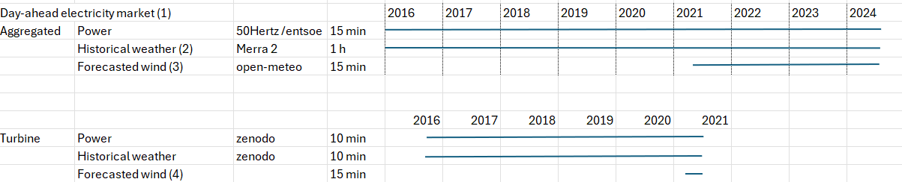

# Datasets

## Overview of Datasets

| **Data Category**               | **Description**                                                                                                             | **Time Period**          | **Time Resolution**               | **Additional Information**                                                                                                         |
|---------------------------------|-----------------------------------------------------------------------------------------------------------------------------|---------------------------|-----------------------------------|-------------------------------------------------------------------------------------------------------------------------------------|
| **1. Aggregated Power Generation** | [Aggregated power generation of 50Hertz's seven onshore wind parks](https://transparency.entsoe.eu/generation/r2/actualGenerationPerProductionType/show?name=&defaultValue=false&viewType=TABLE&areaType=CTA&atch=false&datepicker-day-offset-select-dv-date-from_input=D&dateTime.dateTime=01.01.2024+00:00\|CET\|DAYTIMERANGE&dateTime.endDateTime=01.01.2024+00:00\|CET\|DAYTIMERANGE&area.values=CTY\|10Y1001A1001A83F!CTA\|10YDE-VE-------2&productionType.values=B18&productionType.values=B19&dateTime.timezone=CET_CEST&dateTime.timezone_input=CET+(UTC+1)+/+CEST+(UTC+2)#) | 2016 - 2024              | 15-minute intervals               | Suggested Enrichment: Add weather data, installation capacity ([2019 - 2023](https://www.50hertz.com/xspProxy/api/staticfiles/50hertz-client/images/medien/almanach_2023/240527_50hertz_br_almanac_2023_1920x1080_en.pdf), [2018](https://www.50hertz.com/xspProxy/api/staticfiles/50hertz-client/images/medien/almanach_2023/240527_50hertz_br_almanac_2023_1920x1080_en.pdf)) - 50Hertz's expansion.  |
| **2. Historical Weather Data**   | [Weather data extracted at the geocentric mean of the 50Hertz wind parks](https://goldsmr4.gesdisc.eosdis.nasa.gov/opendap/MERRA2/M2I1NXLFO.5.12.4/contents.html)  | 1980 - 2024              | 1-hour intervals                  |                                                                                                                                    |
| **3. Wind Turbine Data**         | [Individual power generation of a wind turbine (Penmanshiel UK)](https://zenodo.org/records/5946808#.YsWndezMJmo)         | Mid 2016 - Mid 2021      | 10-minute intervals (SCADA data)  | Separate data files per year (+ static data file); SCADA data includes power, weather, and other metrics. Status file records turbine events with start/end times.        |
| **4. Weather Forecast**          | [Weather forecast extracted at the geocentric mean of 50Hertz wind parks](https://open-meteo.com/en/docs/historical-forecast-api#latitude=55.8829&longitude=-2.3056&start_date=2024-10-02&end_date=2024-10-02&minutely_15=temperature_2m,wind_speed_80m&hourly=&wind_speed_unit=ms)  | 22.03.2021 - Present      | 15-minute intervals               | Currently not at the exact geocentric mean.                                                                                        |

## Overview of datasets categorized by type



(1): for the electricity market all kinds of sources (wind, solar, gas) are aggregated
(2): at the geographic centre of the 50Hertz windparks
(3): to be updated
(4): more data to be researched


## Detailed description

### 1. Aggregated Power Data
- [Source: ENTSO-E Transparency Platform](https://transparency.entsoe.eu/generation/r2/actualGenerationPerProductionType/show?name=&defaultValue=false&viewType=TABLE&areaType=CTA&atch=false&datepicker-day-offset-select-dv-date-from_input=D&dateTime.dateTime=01.01.2024+00:00|CET|DAYTIMERANGE&dateTime.endDateTime=01.01.2024+00:00|CET|DAYTIMERANGE&area.values=CTY|10Y1001A1001A83F!CTA|10YDE-VE-------2&productionType.values=B18&productionType.values=B19&dateTime.timezone=CET_CEST&dateTime.timezone_input=CET+(UTC+1)+/+CEST+(UTC+2)#)
- Geocentric mean of 50Hertz wind parks
   - location: Schönermark (PLZ: 16775)
   - [coordinates: longitude=13.125, latitude=53.0, page=24](https://www.50hertz.com/xspProxy/api/staticfiles/50hertz-client/images/medien/almanach_2023/230521_50hertz_br_almanach_2023_1920x1080_de_web.pdf#page=24)
- Also contains aggregated electrical generation output for 3 other providers
   - [TransnetBW](https://www.transnetbw.de/de/kontakt#form)
   - [TenneT](https://www.tennet.eu/de/kontakt)
   - [Amprion](https://www.amprion.net/Grid-Data/Generation/)
- Time Zone: Use UTC to avoid complications due to summer and winter time changes.
- Note: Dataset was downloaded on 11.10.2024 at 17:00 CEST.

### 2. Historical Meteorological data
- [Dataset: inst1_2d_lfo_Nx (M2I1NXLFO)](https://goldsmr4.gesdisc.eosdis.nasa.gov/opendap/MERRA2/M2I1NXLFO.5.12.4/contents.html)
- variables: "HLML": surface layer height (m), "PS": surface pressure (Pa), "QLML": surface specific humidity, "SPEEDLML": surface wind speed (m/s), TLML: surface air temperature (K)
- Format: NetCDF files
- Coordinates: Lattitude/Longitude-based
- Time Zone: All dates and times are in UTC.
- [Dataset Documentation](https://git.earthdata.nasa.gov/projects/ECS/repos/uvg/raw/input/MERRA2.README.pdf?at=refs%2Fheads%2Fdev)
- Note: Dataset was downloaded from 05.10.2024 - 20.10.2024  

### 3. Penmanshiel
- Data provided by Zenodo who obtained it from Cubico Sustainable Investment Ltd, the operator of the Penmanshiel wind farm in the UK
- Zenodo is an open-access repository developed by CERN that enables researchers to share, store, and cite a wide range of research outputs (commissioned by the EC European Commission)
- Data on turbine 09:
   - latitude: 55.904990
   - longitude: -2.291806
- Additional:
   -  Data on wind turbines in [Kelmarsh (UK)](https://zenodo.org/records/5841834)
- Analysis: See notebook "004_zenodo.ipynb"


### 4. Weather Forecasts (any location)
- [Dataset: Historical Forecast API](https://open-meteo.com/en/docs/historical-forecast-api#latitude=55.8829&longitude=-2.3056&)
- Selected parameters:
   - Manually:
      - Latitude: 53, Longitude: 13.125
      - Timezone: "Automatically detect time zone"
      - Start Date: "2021-03.22", End Date: "2024-03-22"
      - Hourly Weather Variables: blank
      - 15-Minutely Weather Variables:
         - Wind Speed (10m)
         - Wind Speed (80m)
      - Daily Weather Variables: blank
      - Settings:
         - Temperature Unit: "Celsius °C"
         - Wind Speed Unit: "m/s"
         - Precipitation Unit: "Millimeter"
         - Timeformat: "ISO 8601 (e.g. 2022-12-31)
   - With link: https://historical-forecast-api.open-meteo.com/v1/forecast?latitude=53&longitude=13.125&start_date=2021-03-22&end_date=2024-03-22&minutely_15=wind_speed_10m,wind_speed_80m&wind_speed_unit=ms&timezone=auto 
   - Downloaded on: 06.11.2024


### 5. Other
- Electricity Load 2011-2014
   - [Dataset: ElectricityLoadDiagrams20112014](https://archive.ics.uci.edu/dataset/321/electricityloaddiagrams20112014)
   - Data Source: UCI Machine Learning Repository
   - Data on the electricity consumption data of 370 clients in portugal
   - Time period: 2011 - 2014
   - Time resolution: 15 minutes
   - Status (05.11.2024): complete dataset from 2011-2014
   - Additional:
      - Data contains no missing values
      - Some clients were created after 2011, in these cases consumption were considered zero
      - Format CSV (semicolon-separated)
      - Each column represent one client
      - Some clients were created after 2011. In these cases consumption were considered zero.


## How to download the Data
1. ENTSO-E Data Source
   1. Create an account on the [ENTSO-E Transparency platform](https://keycloak.tp.entsoe.eu/realms/tp/login-actions/registration?client_id=tp-web&tab_id=0wb6ToHMPwY).
   2. Navigate to "Generation" in the top right, select "All Data Views" then select "Actual Generation per Production Type"
   3. Click on "Control Area"
   4. Select "Germany" and the provider of interest e.g. "CTA|DE(50Hertz)"
   5. Expand "Production Type" and deselect all except "Wind offshore" and "wind onshore"
   6. Select "UTC"
   7. Select any month and day for the year 2017
   8. Click on "Export Data"
   9. Click on "Actual Generation per Production Type (Year, CSV)"
   10. Repeat for the remaining years until 2024

2. MERRA-2
- manual:
   1. [Follow this link to the datasets](https://goldsmr4.gesdisc.eosdis.nasa.gov/opendap/MERRA2/M2I1NXLFO.5.12.4/contents.html)
   2. Choose a year and month
   3. Choose a day (Each nc4 file represents a day)
   4. Select the parameters like this at the example of 2020-08-01
   
- programmatically:
   1. Install Dependencies: Run pip install -r requirements.txt to install necessary packages.
   2. Set Up Authentication: Obtain a MERRA-2 API token (by logging into the website), add it to a .env file as MERRA_TOKEN, and place this file in the same directory as the script.
   3. Run the Script: Call the download_merra function with parameters for the start date, end date, latitude, and longitude.

3. Penmanshiel wind turbines (turbine level)   
   1. Go to https://zenodo.org/records/5946808#.YsWndezMJmo

4. Weather Forecasts (any location)
   1. Go to https://open-meteo.com/en/docs/historical-forecast-api
   2. Use Latitude: 55.90499, longitude: -2.291806 (for the location of Penmanshiel wind turbine 09)
   3. Start Date: 22.03.2021, End Date: present
   4. Leave the section "Hourly Weather Variables" blank
   5. Expand "15-Minutely Weather Variables" and select
      - "Temperature (2m)"
      - "Wind Speed (80 m)"

## Using the Makefile to Download Datasets
For convenience, you can use the provided Makefile to download the MERRA dataset with minimal effort.

Here’s how to do it:

1. **Open a terminal** and navigate to the directory containing the `Makefile`.
2. To download all datasets, run:
   ```bash
   make
3. To download the datasets individually:
* Electricity Load dataset:
   ```bash
   make electricity
* For MERRA-2 Data:
   ```bash
   make merra

### Summary
Once you have downloaded the datasets using the Makefile, you will need to load the data into your analysis environment. The loading functions are provided in the datasets.py file.

## Loading of the datasets
The functions to load the datasets can be found in the datasets.py file. The individual functions are called:
1. ENTSO-E Data Source
- load_entsoe()
2. MERRA-2
- load_merra()
3. Penmanshiel wind turbines (turbine level)
- load_turbine_data()
4. Weather Forecasts (any location)
- TBD
5. Other
- load_electricity()